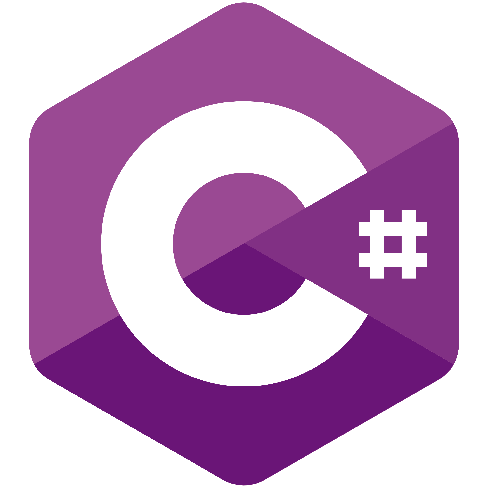

- 👋 Hi, I’m @AshIgnii
- 👀 I’m interested in quantum computing, robotics and physics simulations
- 🌱 I’m currently learning C and C++
- 🎓 Currently in the 1st year of my Computer Science degree

- Experience:  
      |
      Javascript  |
      Lua  |
      Python  |
      Ruby  |
      Ruby on Rails  |
      Kotlin  |
      C#  |
      C ) |
      C++  |
  
[//]: <> ()

  	
